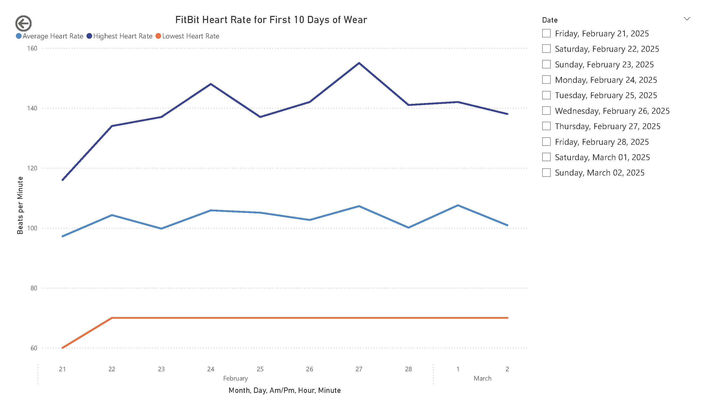
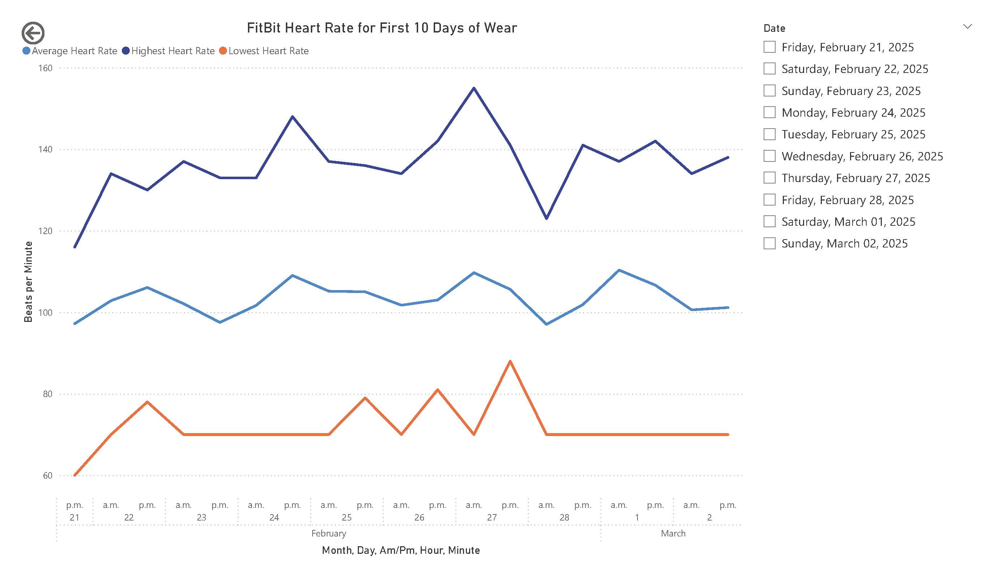
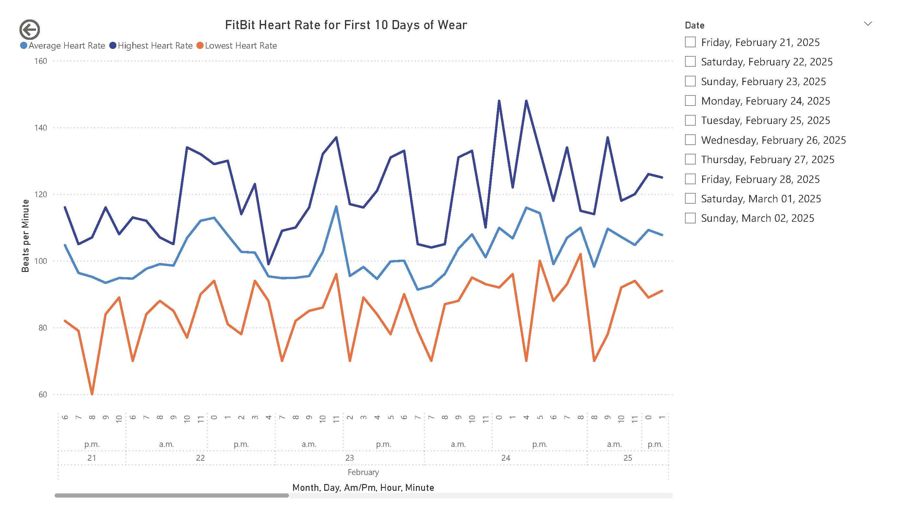
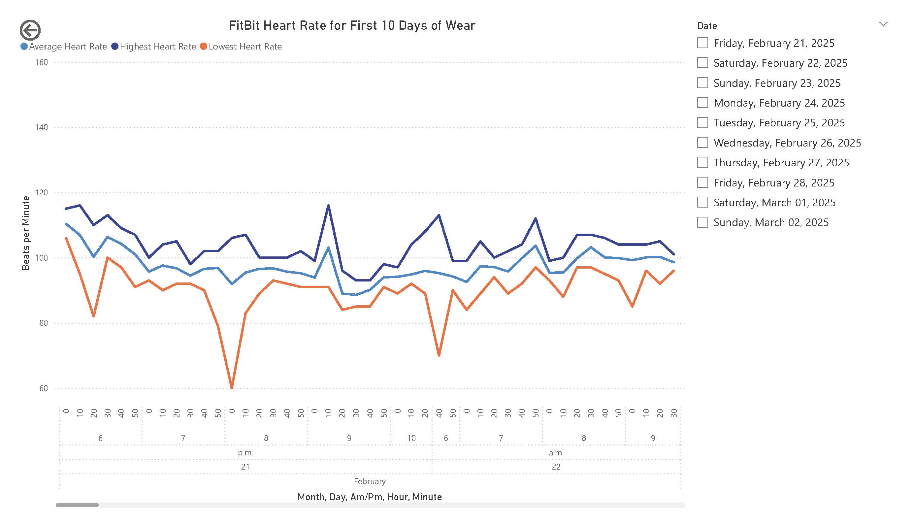

# HeartRate PowerBI Dashboard
A quick dashboard using the first 10 days of my new FitBit's heart rate data. There are three tables: heart_rate, date_dim and time_dim, and three visuals.

## Heart_rate table: 
This table is a combination of each day's heart rate CSV, appended on after another. Google exported the heart rate data with each day in a separate CSV file. I imported each CSV as a table, then appended them all in to one table called "heart_rate." I could have combined the CSV files first, but the end result is the same. The advantage of that approach would be not having the extra tables in my Power BI model. That's something to compare at a later time.
I also added columns with the previous row's timestamp, and the seconds elapsed between the two readings.
## Date_dim: 
This dimension table is a date hierarchy, it is adapted from the script I found on https://radacad.com/all-in-one-script-to-create-date-dimension-in-power-bi-using-power-query. I edited the script to remove all the columns I didn't need. The final script is available in date_dim_script.txt. The only change in Power BI was to remove all the commented out lines, except for the comments explaining what a line does.
## Time_dim: 
This dimension table was created using the script from https://radacad.com/script-for-creating-time-table-in-power-bi-with-hours-minutes-and-seconds-buckets. I did not make any changes to this script. The script I used is available in time_dim_script.txt.

## The Data Visuals: 
### Page 1
This chart shows my high, average and low heart rates. The levels available to drill down into are: Month, Day, Am/PM, Hour, and Minute (in 10 minute buckets). 

Here are some images of the day/time levels, all these images are also in the FitBit_Heart_Rate.pdf file.

--------------------------------------------------------------------------------------------------------------------------

--------------------------------------------------------------------------------------------------------------------------

--------------------------------------------------------------------------------------------------------------------------

### Page 2
This page has two charts showing how often my FitBit took heart rate readings. The top bar chart shows the number of readings with 5, 10, 15, etc seconds from the last reading. The line chart shows the average number of seconds between readings by date. The levels available to drill down into are: Month, Day, Am/PM, Hour, and Minute (in 10 minute buckets).

